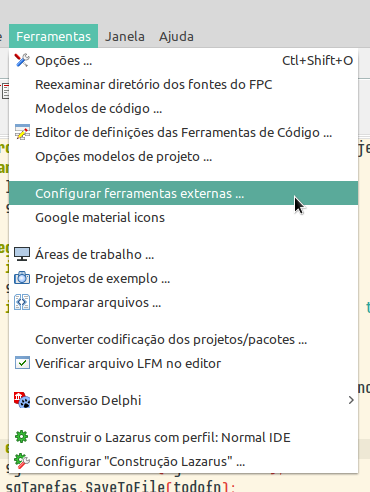
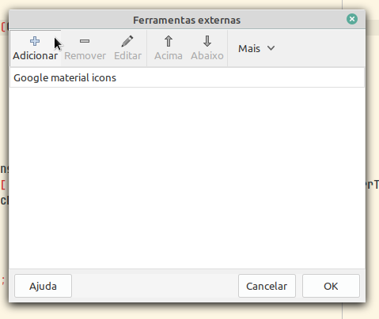
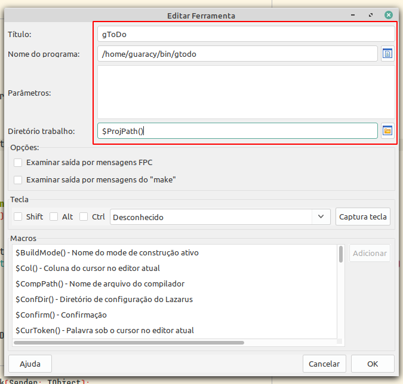
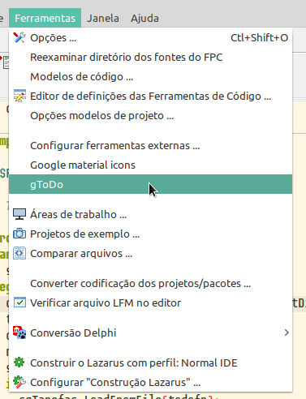
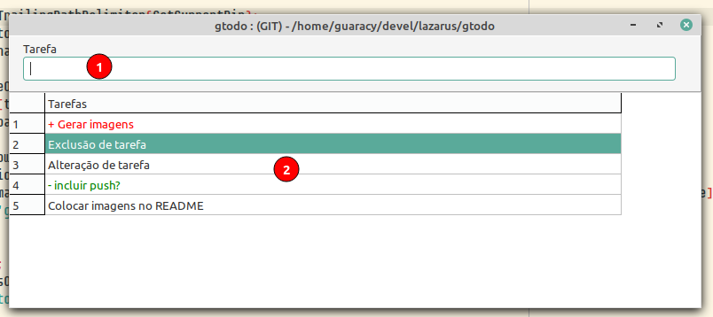
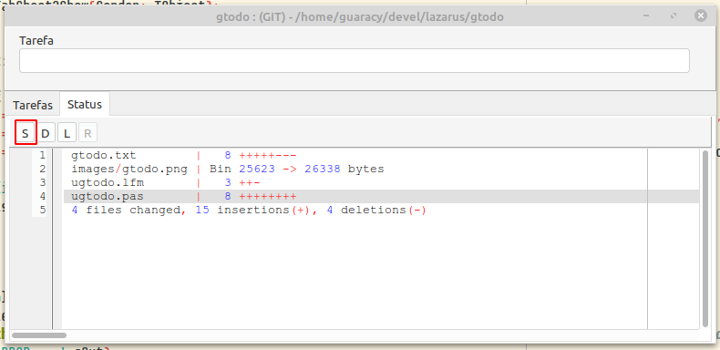
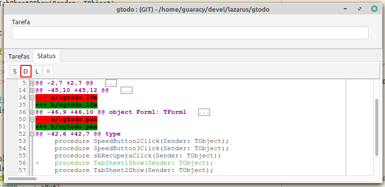
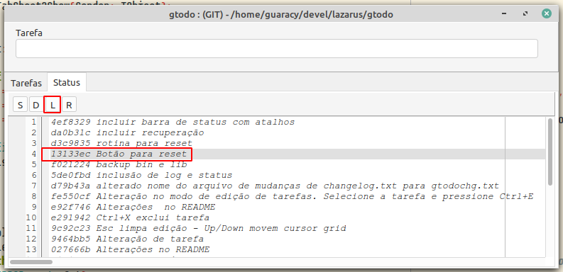

# gtodo

O Lazarus não tem uma maior integração com o git mas é um excelente editor para o que se propõe. O meu problema era adicionar os arquivos e as mensagens de commit. Sair do editor, digitar *git add*, *git commit -m mensagem*. Na correria, acabava com um *git add .*, *git commit -m 'alterações diversas'* e *git push*. No linux nem é tão problemático pois, como uso o zsh+ohmyzsh, basta *ga .*, *gcmsg 'mensagem'* e *gp*. 

É um projeto simples e sem frescuras para o programador criar uma lista de tarefas durante o desenvolvimento de programas. A medida que as tarefas são completadas, ela é excluída da lista (arquivo *gtodo.txt*) e incluída no arquivo *changelog.txt*. Também permite que seja feita uma alteração no programa e, após, use o gtodo para documentar e marcar como completada. Caso esteja trabalhando em uma pasta gerenciada pelo git, o programa automaticamente executa um **git add .** e um **git commit -m tarefa**. São os únicos comandos que o programa conhece do git

Não tem integração com o ToDo do Lazarus mas é possível criar a tarefa utilizando  Ctrl+Shift+T o que facilita a localização da tarefa nos fontes. Após concluir a tarefa, copie, abra o gtodo, inclua a tarefa e marque como concluída.

## Instalação

### Normal

Entre na pasta que você deseja controla e execute o gtodo.

### Lazarus

#### Configurar

1. Menu -> Ferramentas -> Configurar ferramentas externas ...
   
2. Botão Adicionar da janela Ferramentas externas
   
3. Na janela Editar Ferramentas
   1. Informe o Título que irá aparecer no menu
   2. Informe a localização do programa gToDo
   3. Coloque $ProjPath() no diretório de trabalho
      
4. OK e Ok para fechar as janelas e gravar as alterações.

#### Executar

1. Menu -> Ferramentas -> gToDo (ou o nome que você colocou)
   

#### Tarefas

- No título da janela aparece (LOCAL) ou (GIT), conforme a pasta que você estiver trabalhando e o caminho completo.

- **Incluir tarefa**: Em **1** você digita a tarefa que deverá ser executada e pressiona enter para incluir na grade. Se a tarefa iniciar com mais, será mostrada em vermelho, se tiver um hífem será mostrada em verde ou preta caso contrário. Apenas para uma noção de prioridade alta, média e baixa. As tarefas são incluídas no final da lista mas você podera arrastar uma linha para uma outra posição. Se for pressionado Ctrl+Enter, o commit será imediato.

- **Finaliza tarefa**: Basta um duplo clique sobre a tarefa e confirmar se deseja que ela seja completada. Em caso afirmativo, ela será retirada da lista e colocada no início do arquivo *changelog.txt* com a data no formato anomêsdia - tarefa. Se for git, executa um *git add .* e *git commit -m tarefa*.

- **Exclusão de tarefa**: Pressione Ctrl+X para excluir a tarefa selecionada na grade.

- **Alteração de tarefa**: Selecione a tarefa na grade usando o mouse ou as setas para cima e baixo e pressione Ctrl+E. Altere a tarefa e pressione enter. Pressione Esc para cancelar o modo de edição.

#### Status

- Mostra um resumo do que foi alterado desde o último commit. Pode ser vista pressionando o botão S

- Mostra as alterações efetuadas desde o último commit. É possível expandir os ítens para ver o que foi alterado em cada arquivo. Pode ser vista pressionando o botão D

- Mostra o log do git com cada commit efetuado. Quando visível (botão L), o botão R é habilitado e permite que se faça um reset retornando ao estado do commit especificado. Todos os commits posteriores serão excluídos. Para recuperar, você deve ler o manual do Git e deve efetuar os comandos em um terminal. A dica é `git reflog` e, por exemplo, `git reset HEAD@{3}`.
