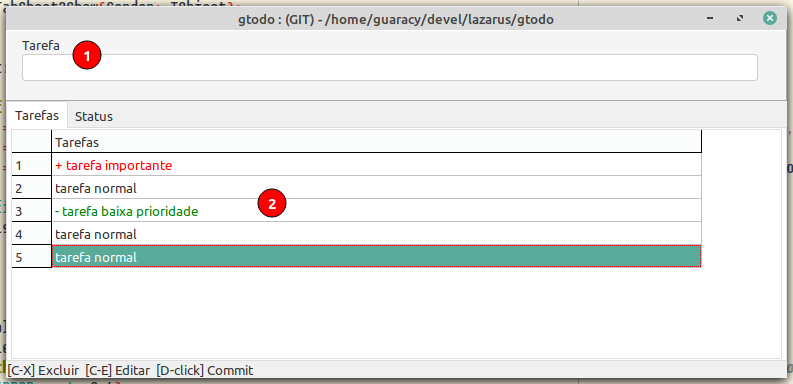

# gtodo

É um projeto simples e sem frescuras para o programador criar uma lista de tarefas durante o desenvolvimento de programas. A medida que as tarefas são completadas, ela é excluída da lista (arquivo *gtodo.txt*) e incluída no arquivo *changelog.txt*. Caso esteja trabalhando em uma pasta gerenciada pelo git, o programa automaticamente executa um **git add .** e um **git commit -m tarefa**. São os únicos comandos que o programa conhece do git

## Instalação

### Normal

Entre na pasta que você deseja controla e execute o gtodo.

### Lazarus

#### Configurar

1. Menu -> Ferramentas -> Configurar ferramentas externas ...
   
2. Botão Adicionar da janela Ferramentas externas
   
3. Na janela Editar Ferramentas
   1. Informe o Título que irá aparecer no menu
   2. Informe a localização do programa gToDo
   3. Coloque $ProjPath() no diretório de trabalho
      
4. OK e Ok para fechar as janelas e gravar as alterações.

#### Executar

1. Menu -> Ferramentas -> gToDo (ou o nome que você colocou)
   

2. gtodo
   
- No título da janela aparece (LOCAL) ou (GIT), conforme a pasta que você estiver trabalhando e o caminho completo.

- **Incluir tarefa**: Em **1** você digita a tarefa que deverá ser executada e pressiona enter para incluir na grade. Se a tarefa iniciar com mais, será mostrada em vermelho, se tiver um hífem será mostrada em verde ou preta caso contrário. Apenas para uma noção de prioridade alta, média e baixa. As tarefas são incluídas no final da lista mas você podera arrastar uma linha para uma outra posição. 

- **Finaliza tarefa**: Basta um duplo clique sobre a tarefa e confirmar se deseja que ela seja completada. Em caso afirmativo, ela será retirada da lista e colocada no início do arquivo *changelog.txt* com a data no formato anomêsdia - tarefa. Se for git, executa um *git add .* e *git commit -m tarefa*.

- **Exclusão de tarefa**: Ainda não implementado

- **Alteração de tarefa**: Ainda não implementado.
